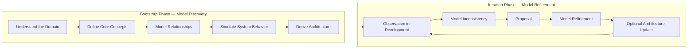

# The Sheldon Cycle

**A model‑first workflow for AI‑assisted software design.**

**Design the system before implementation — and keep refining the model while the AI writes the code.**

LLMs are extremely good at **implementing systems**.  
They are much less reliable at **inventing the system model while coding**.

The Sheldon Cycle helps make that model explicit first.

---

## Why This Exists

To restate the core problem:  
Large Language Models are very good at **implementing systems**.  
They are **terrible at guessing them**.

Most AI‑assisted development fails not because the AI writes bad code, but because the **system model is implicit, incomplete, or inconsistent**.

Does that sound familiar?

Because the failure pattern is almost always the same:

The AI starts writing code immediately. Everyone feels productive. The commits pile up. Progress appears to be happening.

Only later does it become clear that nobody actually agreed on what the system is supposed to be.

The real problem usually isn’t bad code.

It’s that the **system model was never made explicit**.

Concepts are fuzzy.  
Relationships are assumed.  
Terminology drifts.  
Architecture emerges accidentally.

At first everything looks fine.

Then reality arrives.

And reality rarely knocks politely on the door.  
Reality tends to show up with a wrecking ball.

The Sheldon Cycle addresses this problem by making the **system model explicit before implementation begins** and providing a **workflow for iteratively refining it during development**.

It may start with what looks like careful, even slightly bureaucratic planning — the kind that might make impatient developers twitch.

But the process does not abandon you once reality pushes back. Because sooner or later, reality will show up and inform you that some of your beautiful assumptions were wrong.

---

## Quick Start (with ChatGPT or Claude)

The Sheldon Cycle is designed to start as a **dialogue with a reasoning LLM**.

The easiest way to begin is simply to tell the LLM that you want to use the method and provide the repository link.

> NOTE: The following prompt should **NOT** be used in Claude Code or Code. Use it in ChatGPT's or Claude's **CHAT** on https://chatgpt.com/ or https://claude.ai/ or their apps.

Example prompt:

```
I want to plan a software project using the Sheldon Cycle.

Please follow the method described here:
https://github.com/DerFuchs/sheldon-cycle

Guide me through the bootstrap phase step by step and help me produce the required documents.
```

The LLM should then guide you through the bootstrap process and help you generate the core artifacts:

```
PROJECT_BRIEFING
→ DOMAIN_MODEL
→ CORE_PRINCIPLES
→ CONCEPT_MODEL
→ RELATIONSHIP_MODEL
→ SYSTEM_MODEL
→ ARCHITECTURE
```

These documents form the **explicit system model**.

Once the model is stable, you can head over to Claude Code or Codex.
Implementation can begin and the iteration loop of the Sheldon Cycle takes over.

---

## Core Rule

The Sheldon Cycle follows one fundamental rule:

```
Reality → Model → Architecture → Implementation
```

In other words:

1. **Understand reality first** – explore the domain and its constraints.  
2. **Create an explicit system model** – concepts, relationships, and behavior.  
3. **Derive architecture from the model** – not the other way around.  
4. **Only then implement the system.**

Most software projects accidentally follow the reverse order:

```
Idea → Code → Accidental Architecture → Confusion
```

The Sheldon Cycle deliberately prevents this.

---

## One‑Page Overview

The Sheldon Cycle can be summarized as a **two‑stage process**: first discover the system model, then refine it as reality challenges the assumptions.



**Bootstrap Phase — Model Discovery**

The process begins as a **dialogue between a human and a reasoning LLM**.  
The goal is to transform a vague idea into a **clear system model**.

Outputs typically include:

- `DOMAIN_MODEL.md`
- `CORE_PRINCIPLES.md`
- `CONCEPT_MODEL.md`
- `RELATIONSHIP_MODEL.md`
- `SYSTEM_MODEL.md`
- `ARCHITECTURE.md`

These documents represent the **explicit system model**.

**Iteration Phase — Model Refinement**

Once implementation begins, reality inevitably exposes weaknesses in the model.

Instead of collapsing into ad‑hoc fixes, the Sheldon Cycle uses a structured loop:

```
Observation → Inconsistency → Proposal → Model Refinement → Architecture Update
```

The model is refined, documents are updated, and development continues with a **more accurate understanding of the system**.

In short:

**Think with the AI → Define the model → Let the AI implement → Refine the model when reality disagrees.**

---


## The Sheldon Cycle

### Bootstrap Flow

```text
Bootstrap Phase (Model Discovery)

understand the domain
→ define core concepts
→ model relationships
→ simulate system behavior
→ derive architecture
→ implementation may begin
```

### Iteration Flow

```text
Iteration Phase (Model Refinement)

observation
→ model inconsistency detected
→ proposal
→ model refinement
→ optional architecture update
→ implementation continues
```

The bootstrap flow is the original entry into the method.  
It is used to think through a system before implementation starts.

The iteration flow is used later, once implementation or further analysis reveals gaps, ambiguities, or contradictions in the current model.

Together, these two flows allow the system design to evolve **without losing conceptual coherence**.

The bootstrap phase is typically conducted in a **dialogue with a conversational LLM** (such as ChatGPT or Claude), where the human and AI collaboratively shape the system model.

The iteration phase then continues during development, where the evolving code and real‑world feedback reveal inconsistencies in the model. Those inconsistencies trigger the refinement loop.

---

## What Problems This Solves

The Sheldon Cycle helps prevent common AI‑assisted development problems:

- implicit system models
- terminology drift
- architectural chaos
- hidden assumptions
- AI hallucinating missing concepts
- premature implementation

### Familiar Anti‑Patterns

If you have built systems with AI assistants, these situations may feel familiar:

- The AI writes large amounts of code very quickly, but nobody can clearly explain the system model.
- The same concept is implemented three different ways because the terminology was never defined.
- The architecture slowly emerges from code instead of being derived from the model.
- Refactoring becomes painful because changing one concept reveals hidden assumptions everywhere.
- The AI confidently implements something that was never actually agreed upon.

The Sheldon Cycle exists to make these failure modes **visible early**, when they are still cheap to fix.

Instead, the workflow forces clarity before code.

---

## Structured Dialogue Instead of Overnight Automation

The Sheldon Cycle intentionally **does not follow the popular idea of letting an AI assistant “build the whole system overnight.”**

Instead, it treats AI‑assisted development as a **structured dialogue between a human and a reasoning LLM**.

Two roles exist in this dialogue:

Human:
- understands context
- interprets real‑world ambiguity
- challenges assumptions
- decides between competing ideas

AI:
- structures the reasoning process
- analyzes the evolving model
- highlights inconsistencies
- assists with deterministic implementation

Development therefore becomes a process of **passing the baton back and forth** between human reasoning and machine precision.

---

## Templates

The `/templates` directory contains ready‑to‑use project files:

- `PROJECT_BRIEFING.md`
- `PROJECT_METHOD.md`
- `PROJECT_STRUCTURE.md`
- `PROJECT_BOOTSTRAP.md`
- `AI_AGENT_GUIDE.md`
- `PROPOSAL_TEMPLATE.md`
- `DECISION_LOG.md`
- `DESIGN_REVIEW.md`

These files provide the **Design‑OS** for a project.

---

## Example (Planned)

A full example project demonstrating the Sheldon Cycle will be published in `/examples`.

The example will show how the workflow can be used to design a real system step by step.

---

## Philosophy

The Sheldon Cycle is inspired by:

- scientific reasoning
- system modeling
- architecture‑first design
- AI‑assisted development

It is intentionally lightweight and documentation‑driven.

The goal is not to add process overhead, but to **remove architectural illusions before code is written**.

---

## License

MIT